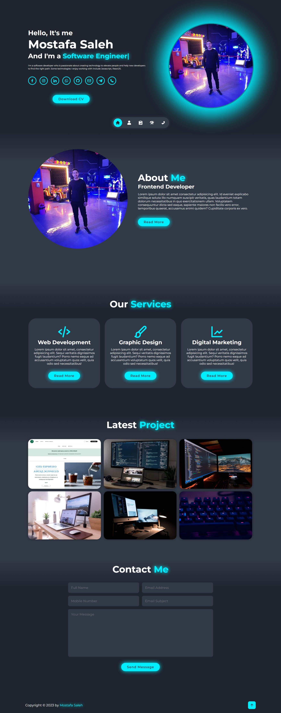

# My Profile

This project is a profile website for me, on which i can post my links, ideas, projects and everything related to me. You can consider it as a portfolio and a blog at the same time.

## Project Description

The website was developed at first using pure html, css and javascript. And later, I've converted the website into a React Js application.

## Current status

